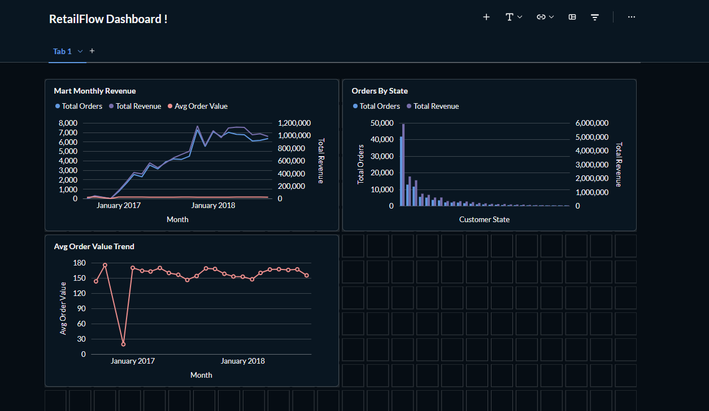

# RetailFlow — End-to-End Data Engineering Pipeline

An end-to-end data pipeline built with Apache Airflow, dbt, PostgreSQL, BigQuery, and Metabase using the Olist Brazilian E-commerce dataset (100k+ orders).


## Stack

| Layer | Tool |
|---|---|
| Ingestion | Apache Airflow |
| Storage | PostgreSQL (local) · BigQuery (cloud) |
| Transformation | dbt |
| Visualization | Metabase |
| Infrastructure | Docker Compose |
| CI/CD | GitHub Actions |

## Architecture

```
Raw CSVs → Airflow DAG → PostgreSQL → dbt (staging → facts → marts) → Metabase
                                   ↘ BigQuery (cloud warehouse)
```

## dbt Layers

- **Staging** — clean and cast raw source data (`stg_orders`, `stg_customers`, `stg_order_items`, `stg_payments`)
- **Facts** — joined and aggregated order-level data (`fct_orders`)
- **Marts** — business KPI tables (`mart_monthly_revenue`, `mart_orders_by_state`)

## Dashboard



## CI/CD

GitHub Actions runs `dbt seed → dbt run → dbt test` on every push using sample seed data against a Postgres service container.

## Dataset

[Olist Brazilian E-commerce](https://www.kaggle.com/datasets/olistbr/brazilian-ecommerce) — 100k+ orders across 27 Brazilian states (2016–2018)

## How to Run

```bash
# Start the stack
docker compose up -d

# Run dbt models (Postgres)
cd dbt/retailflow
dbt run

# Run dbt models (BigQuery)
dbt run --target bigquery

# Run tests
dbt test
```


